# SCREENFLOW - SAA Mobile

> Auto-generated screen flow mapping from Figma designs.
> Last updated: 2026-04-16

## Project Info

| Key        | Value                          |
| ---------- | ------------------------------ |
| File Key   | 9ypp4enmFmdK3YAFJLIu6C        |
| Platform   | iOS (Mobile)                   |
| Total Frames | 139                          |
| iOS Screens  | 30                           |

## Discovery Progress

| Metric       | Count |
| ------------ | ----- |
| Total iOS    | 30    |
| Discovered   | 8     |
| Pending      | 22    |
| Progress     | 27%   |

## Screens

| # | Screen Name | Screen ID | Status | Key APIs | Navigations |
|---|-------------|-----------|--------|----------|-------------|
| 1 | [iOS] Home | OuH1BUTYT0 | discovered | GET /awards, GET /kudos, GET /event-countdown | Login, Awards, Kudos, Profile, Search, Notifications, Send Kudos, Award Detail, Kudos Detail, Language Selection |
| 2 | [iOS] Login | 8HGlvYGJWq | pending | | |
| 3 | [iOS] 404 | sn2mdavs1a | pending | | |
| 4 | [iOS] Access denied | k-7zJk2B7s | pending | | |
| 5 | [iOS] Award_Best Manager | 7y195PPTxQ | discovered | GET /api/awards, GET /api/awards/:id | Home -> Awards, Dropdown filter, Bottom Nav (SAA 2025, Kudos, Profile), Nút Chi tiết Kudos |
| 6 | [iOS] Award_MVP | b2BuS8HYIt | discovered | GET /api/awards, GET /api/awards/:id | Home -> Awards, Dropdown filter, Bottom Nav (SAA 2025, Kudos, Profile), Nút Chi tiết Kudos |
| 7 | [iOS] Award_Signature 2025 - Creator | O98TwiHaJe | discovered | GET /api/awards, GET /api/awards/:id | Home -> Awards, Dropdown filter, Bottom Nav (SAA 2025, Kudos, Profile), Nút Chi tiết Kudos |
| 8 | [iOS] Award_Top project | FQoJZLkG_d | discovered | GET /api/awards, GET /api/awards/:id | Home -> Awards, Dropdown filter, Bottom Nav (SAA 2025, Kudos, Profile), Nút Chi tiết Kudos |
| 9 | [iOS] Award_Top project leader | QQvsfK3yaK | discovered | GET /api/awards, GET /api/awards/:id | Home -> Awards, Dropdown filter, Bottom Nav (SAA 2025, Kudos, Profile), Nút Chi tiết Kudos |
| 10 | [iOS] Award_Top talent | c-QM3_zjkG | discovered | GET /api/awards, GET /api/awards/:id | Home -> Awards, Dropdown filter, Bottom Nav (SAA 2025, Kudos, Profile), Nút Chi tiết Kudos |
| 11 | [iOS] Language dropdown | uUvW6Qm1ve | pending | | |
| 12 | [iOS] Open secret box | kQk65hSYF2 | pending | | |
| 13 | [iOS] Open secret box- action | KUmv414uC9 | pending | | |
| 14 | [iOS] Open secret box- Standby 1 | -LIblaeusT | pending | | |
| 15 | [iOS] Open secret box- Standby 2 | IXpGakYRm5 | pending | | |
| 16 | [iOS] Open secret box- Standby 3 | _cWAEarZPi | pending | | |
| 17 | [iOS] Open secret box- Standby 4 | scvV-OQCAJ | pending | | |
| 18 | [iOS] Open secret box- Standby 5 | wsI6gaO_yc | pending | | |
| 19 | [iOS] Open secret box- Standby 6 | xptNUunBS_ | pending | | |
| 20 | [iOS] Open secret box- Standby 7 | FvTOS7oCPU | pending | | |
| 21 | [iOS] Profile bản thân | hSH7L8doXB | pending | | |
| 22 | [iOS] Profile người khác | bEpdheM0yU | pending | | |
| 23 | [iOS] Sun*Kudos | fO0Kt19sZZ | discovered | GET /api/v1/kudos/highlight, GET /api/v1/kudos, GET /api/v1/spotlight/network, GET /api/v1/users/me/stats, GET /api/v1/kudos/top-recipients, GET /api/v1/hashtags, GET /api/v1/departments | SendKudos(PV7jBVZU1N), AllKudos(j_a2GQWKDJ), KudosDetail(T0TR16k0vH), SpotlightSearch(3jgwke3E8O), OpenSecretBox(kQk65hSYF2), UserProfile(bEpdheM0yU), HashtagDropdown(V5GRjAdJyb), DepartmentDropdown(76k69LQPfj), LanguageDropdown(uUvW6Qm1ve), Searching(hldqjHoSRH), BottomNav: Home/Awards/Profile |
| 24 | [iOS] Sun*Kudos_All Kudos | j_a2GQWKDJ | pending | | |
| 25 | [iOS] Sun*Kudos_Gửi lời chúc Kudos | PV7jBVZU1N | pending | | |
| 26 | [iOS] Sun*Kudos_Searching | hldqjHoSRH | pending | | |
| 27 | [iOS] Sun*Kudos_Search Sunner | 3jgwke3E8O | pending | | |
| 28 | [iOS] Sun*Kudos_View kudo | T0TR16k0vH | pending | | |
| 29 | [iOS] Sun*Kudos_View kudo ẩn danh | 5C2BL6GYXL | pending | | |
| 30 | [iOS] Thể lệ | zIuFaHAid4 | pending | | |

## Navigation Graph

```mermaid
graph TD
    Home["[iOS] Home"]
    Login["[iOS] Login"]
    Awards_TopTalent["[iOS] Award_Top talent"]
    Awards_TopProject["[iOS] Award_Top project"]
    Awards_TopProjectLeader["[iOS] Award_Top project leader"]
    Awards_MVP["[iOS] Award_MVP"]
    Awards_BestManager["[iOS] Award_Best Manager"]
    Awards_Signature["[iOS] Award_Signature 2025 - Creator"]
    Kudos["[iOS] Sun*Kudos"]
    KudosAllKudos["[iOS] Sun*Kudos_All Kudos"]
    SendKudos["[iOS] Sun*Kudos_Gửi lời chúc Kudos"]
    Profile["[iOS] Profile bản thân"]
    Search["[iOS] Sun*Kudos_Searching"]
    LanguageDropdown["[iOS] Language dropdown"]
    TheLe["[iOS] Thể lệ"]

    Login -->|after login| Home
    Home -->|Bottom Nav: Awards| Awards_TopTalent
    Home -->|Bottom Nav: Kudos| Kudos
    Home -->|Bottom Nav: Profile| Profile
    Home -->|Header: Search| Search
    Home -->|Header: Language| LanguageDropdown
    Home -->|ABOUT AWARD button| TheLe
    Home -->|ABOUT KUDOS button| Kudos
    Home -->|Award card: Chi tiết| Awards_TopTalent
    Home -->|FAB: Pencil| SendKudos
    Home -->|FAB: Kudos icon| KudosAllKudos

    %% Award Detail điều hướng (chung cho 6 biến thể)
    Awards_TopTalent -->|Bottom Nav: SAA 2025| Home
    Awards_TopTalent -->|Bottom Nav: Kudos| Kudos
    Awards_TopTalent -->|Bottom Nav: Profile| Profile
    Awards_TopTalent -->|Nút Chi tiết Kudos| Kudos
    Awards_TopTalent -->|Header: Language| LanguageDropdown
    Awards_TopTalent -->|Header: Search| Search
    Awards_TopTalent -->|Dropdown filter| Awards_TopProject
    Awards_TopTalent -->|Dropdown filter| Awards_TopProjectLeader
    Awards_TopTalent -->|Dropdown filter| Awards_BestManager
    Awards_TopTalent -->|Dropdown filter| Awards_Signature
    Awards_TopTalent -->|Dropdown filter| Awards_MVP

    %% Sun*Kudos điều hướng
    KudosDetail["[iOS] Sun*Kudos_View kudo"]
    ProfileOther["[iOS] Profile người khác"]
    OpenSecretBox["[iOS] Open secret box"]
    SpotlightSearch["[iOS] Sun*Kudos_Search Sunner"]

    Kudos -->|CTA Hero/Feed bottom| SendKudos
    Kudos -->|"Xem tất cả" link| KudosAllKudos
    Kudos -->|"Xem chi tiết" on card| KudosDetail
    Kudos -->|Spotlight: Tìm kiếm sunner| SpotlightSearch
    Kudos -->|"Mở hộp bí mật" button| OpenSecretBox
    Kudos -->|Tap avatar on kudos card| ProfileOther
    Kudos -->|Header: Language| LanguageDropdown
    Kudos -->|Header: Search| Search
    Kudos -->|Bottom Nav: SAA 2025| Home
    Kudos -->|Bottom Nav: Awards| Awards_TopTalent
    Kudos -->|Bottom Nav: Profile| Profile
```

## API Endpoints Summary

| Method | Endpoint | Screen(s) | Purpose |
|--------|----------|-----------|---------|
| GET | /api/awards | [iOS] Home | Load award categories list |
| GET | /api/kudos/info | [iOS] Home | Load Kudos section info |
| GET | /api/event/countdown | [iOS] Home | Get countdown timer data |
| GET | /api/awards | Award Detail (6 biến thể) | Lấy danh sách giải thưởng cho dropdown |
| GET | /api/awards/:id | Award Detail (6 biến thể) | Lấy chi tiết giải thưởng (tên, mô tả, số lượng, giá trị, hình ảnh) |
| GET | /api/v1/kudos/highlight | [iOS] Sun*Kudos | Top 5 highlight kudos (filter: hashtag, department) |
| GET | /api/v1/kudos | [iOS] Sun*Kudos, [iOS] Sun*Kudos_All Kudos | Danh sách tất cả kudos (paginated, filterable) |
| POST | /api/v1/kudos/{id}/heart | [iOS] Sun*Kudos | Thả heart cho kudos |
| DELETE | /api/v1/kudos/{id}/heart | [iOS] Sun*Kudos | Bỏ heart kudos (unlike) |
| GET | /api/v1/spotlight/network | [iOS] Sun*Kudos | Dữ liệu network graph cho Spotlight Board |
| GET | /api/v1/users/me/stats | [iOS] Sun*Kudos | Thống kê cá nhân (kudos nhận/gửi, hearts, secret boxes) |
| GET | /api/v1/kudos/top-recipients | [iOS] Sun*Kudos | Top 10 Sunner nhận quà mới nhất |
| GET | /api/v1/hashtags | [iOS] Sun*Kudos | Danh sách hashtags cho dropdown filter |
| GET | /api/v1/departments | [iOS] Sun*Kudos | Danh sách phòng ban cho dropdown filter |
| GET | /api/v1/users/me/secret-boxes/next | [iOS] Sun*Kudos | Lấy boxId hộp bí mật tiếp theo chưa mở |
| POST | /api/v1/users/me/secret-boxes/{boxId}/open | [iOS] Sun*Kudos | Mở hộp bí mật theo boxId |
| GET | /api/v1/users/search | [iOS] Sun*Kudos_Search Sunner | Tìm kiếm Sunner cho Spotlight Board |

## Screen Groups

| Group | Screens |
|-------|---------|
| Auth | Login |
| Home | Home |
| Awards | Award Detail (6 biến thể cùng layout: Top Talent, Top Project, Top Project Leader, Best Manager, Signature 2025 - Creator, MVP) - chuyển đổi qua dropdown filter |
| Kudos | Sun*Kudos, Sun*Kudos_All Kudos, Sun*Kudos_Gửi lời chúc Kudos, Sun*Kudos_Searching, Sun*Kudos_Search Sunner, Sun*Kudos_View kudo, Sun*Kudos_View kudo ẩn danh |
| Profile | Profile bản thân, Profile người khác |
| Secret Box | Open secret box (x8 variants) |
| Error | 404, Access denied |
| Utility | Language dropdown, Thể lệ |

## Discovery Log

| Date | Screen | Action | Notes |
|------|--------|--------|-------|
| 2026-04-10 | [iOS] Home | discovered | Hero screen with countdown, awards section, kudos section, FAB, bottom nav |
| 2026-04-14 | [iOS] Award Detail (6 biến thể) | discovered | 6 biến thể cùng layout: Top Talent, Top Project, Top Project Leader, Best Manager, Signature 2025 - Creator, MVP. Chuyển đổi qua dropdown filter. Signature Creator có layout khác biệt nhỏ (2 dòng giá trị: cá nhân + tập thể). Spec chung: ios_award_detail.md |
| 2026-04-16 | [iOS] Sun*Kudos (fO0Kt19sZZ) | discovered | Màn hình trung tâm Kudos: Hero banner + CTA gửi kudos, Highlight Kudos carousel (max 5, filter hashtag/phòng ban), Spotlight Board (network chart pan-zoom), All Kudos feed (infinite scroll), Personal Stats block, Top 10 Sunner nhận quà. 13 outgoing navigations. 7 APIs on load + 5 APIs on action. Spec: ios_sun_kudos.md |
